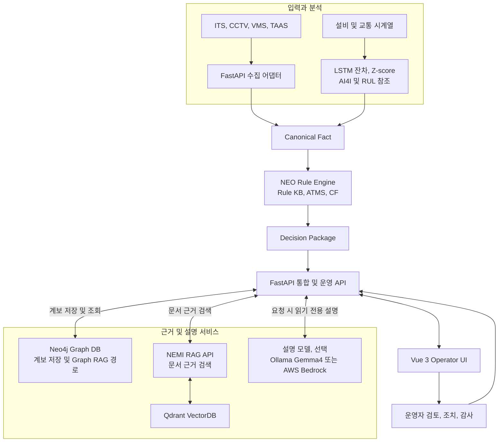
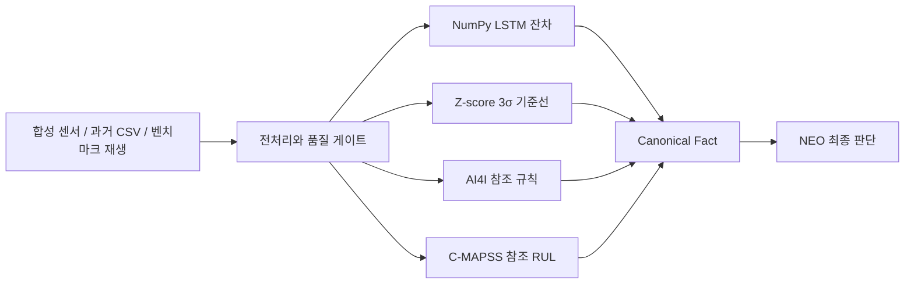

# NEO Intelligent ITS Operator

단일 수치나 알람만으로는 현장 상황을 정확히 판단하기 어렵습니다. NEO는 여러 관제 입력을 종합해 위험도를 판단하고, 판단 근거와 대응 가이드까지 함께 제공하는 지능형 관제 시스템입니다.

> 학부 시절 학습과 튜닝에 참여했던 NEO 규칙 추론 엔진을 사용했습니다. ITS 관제 입력 정규화, 판단 근거 연동, 운영 화면과 AWS 배포는 개인 프로젝트에서 구현했습니다.

- **AWS 데모:** https://3-38-33-156.sslip.io/neo
- **최신 릴리즈:** https://github.com/hannip0461/NEO-Intelligent-ITS-Operator/releases/tag/v2.0.0

## 주요 화면

| 실시간 관제와 운영 검토 | Neo4j XAI 추론 계보 |
| --- | --- |
|  |  |
| **예지 및 이상 분석** | **판단 및 조치 이력** |
|  |  |
| **핵심 서비스 상태** | **정책 초안 검토** |
|  |  |

## 프로젝트 개요

교통 관제에서는 속도 저하, 정체 신호, CCTV 시야 제한처럼 서로 다른 입력이 동시에 발생합니다. 하나의 경보만 사용하면 과잉 대응하거나 중요한 충돌 신호를 놓칠 수 있습니다.

FastAPI는 입력을 Canonical Fact로 정규화해 NEO Rule KB에 전달합니다. NEO는 ATMS로 가정과 충돌 근거를 관리하고 CF로 판단 강도를 계산한 뒤, 후속 규칙을 통해 위험도와 대응 가이드를 단계적으로 생성합니다. Neo4j에는 판단 관계를 저장하고 NEMI에서는 관련 문서를 검색해, 운영자가 판단과 연결 근거를 함께 확인할 수 있습니다.

| 영역 | 구현 결과 |
| --- | --- |
| 입력 정규화 | ITS CSV, 교통 API, CCTV, VMS, TAAS 입력을 Canonical Fact로 변환 |
| 규칙 추론 | NEO Rule KB + ATMS + CF 기반 다단계 파생 Fact 생성 |
| 관계 근거 | Neo4j 실제 노드와 관계로 Fact → Rule → Decision 계보 조회 |
| 문서 근거 | NEMI VectorDB RAG로 SOP, 정책, 사고 이력 검색 |
| 판단 설명 | 선택한 Decision Package와 연결 근거를 읽기 전용으로 설명 |
| 운영 검토 | 판단 재실행, 근거 선택, 조치 준비, 오탐 요청과 감사 이력 제공 |
| 예지 및 이상 분석 | LSTM 잔차, 통계 기준선, AI4I 참조 규칙, C-MAPSS 참조 RUL을 Canonical Fact와 NEO 판단으로 연결 |
| 배포 | Docker Compose, AWS EC2, Nginx, HTTPS 자동 갱신 구성 |

## 핵심 운영 시나리오

1. 관제자가 실시간 사건과 입력 센서를 선택합니다.
2. FastAPI가 입력을 정규화하고 NEO 판단을 실행합니다.
3. NEO가 Rule KB, ATMS, CF를 적용해 Decision Package를 생성합니다.
4. Neo4j에서 판단 계보를 조회하고 NEMI에서 관련 문서 근거를 검색합니다.
5. 관제자가 근거를 검토한 뒤 VMS 조치를 준비하거나 오탐 처리를 요청합니다.
6. 판단, 근거, 조치 상태를 감사 ID와 함께 보존하고 이력 화면에서 재현합니다.

최종 조치는 자동 송출하지 않습니다. NEO가 판단하고 운영자가 검토하고 승인하는 경계를 유지합니다.

### 대표 시연 사건 5개

| 사건 | 입력 충돌과 상태 | 실제 NEO 판단 |
| --- | --- | --- |
| INC-9902 연쇄 추돌 위험 | 정체 + CCTV 시야 제한 | 운영자 승인 필요 |
| INC-9901 낙하물 의심 | 레이더 단독 감지 | 관찰 후 재확인 |
| INC-9903 우회로 포화 | 본선 정체 + 우회 연결로 포화 | 교통 상황 검토 |
| INC-9904 시야 제한 단독 감지 | CCTV 저시정 + 정상 교통 흐름 | 관찰 후 재확인 |
| INC-9897 정체 회복 | 속도 회복 추세 | 교통 흐름 모니터링 |

사건별 입력 Fact가 서로 다른 Rule과 매칭되며, 그 결과에 따라 판단과 권고 조치가 달라집니다.

## 시스템 구성



| 구성요소 | 책임 |
| --- | --- |
| NEO Engine | 규칙 매칭, 충돌 관리, CF 계산과 파생 Fact 생성 |
| FastAPI | 입력 정규화, NEO 실행과 외부 연동 조율 |
| Neo4j | Fact, Rule, Decision 관계 저장과 XAI 계보 조회 |
| NEMI | 프로젝트에서 명명한 Qdrant 기반 VectorDB RAG, 운영 문서 근거 검색 |
| Qdrant | NEMI 임베딩과 유사도 검색 저장소 |
| Vue 3 + TypeScript | 사건 선택, 근거 검토, 조치와 감사 이력 UI |
| 설명 모델 (선택) | Decision Package와 연결 근거 설명, NEO 판단 변경 권한 없음 |

## 구현 상세

### 규칙 추론과 충돌 관리

- 원시 입력을 스키마 검증된 Canonical Fact로 변환합니다.
- Fact가 Rule을 활성화하고, 파생 Fact가 다음 Rule에 다시 적용되는 다단계 추론을 수행합니다.
- ATMS가 가정, 지지, 충돌 집합을 관리하고 CF가 복수 근거의 판단 강도를 계산합니다.
- `Decision Package`에 KB 버전, Rule Set 버전과 KB SHA-256을 기록해 판단 시점의 지식 기준을 고정합니다.

### 관계와 문서 근거

- Neo4j API로 실제 그래프를 저장하고 조회하며 선택 노드와 판단 경로를 분리해 탐색합니다.
- NEMI는 Qdrant에서 SOP, VMS 정책, TAAS 사고 이력 등 판단과 관련된 문서를 검색합니다.
- Neo4j와 NEMI는 근거를 제공할 뿐 NEO의 결론을 생성하거나 덮어쓰지 않습니다.

### 운영 안전과 감사

- 판단 실행, 계보 확인, 문서 근거 확인, 조치 준비를 명시적 단계로 분리했습니다.
- 운영자 승인 전에는 VMS 조치를 자동 송출하지 않습니다.
- 사건, 판단, 선택 근거, 조치 상태와 감사 ID를 함께 저장해 이후 재현할 수 있습니다.

### 예지 및 이상 분석



- 설비 4종과 교통 2종 시나리오를 동일 API에서 실행하고 각 분석 단계를 화면에서 확인합니다.
- AI4I는 데이터셋 학습 모델이 아닌 참조 규칙 매핑이며, RUL은 대상 설비에 보정되지 않은 시뮬레이션 기준값입니다.
- 교통 CSV와 FT-AED, PeMS 입력은 과거 데이터 재생이며 현재 교통 상태나 국내 현장 검증 결과를 의미하지 않습니다.

## 실행

Docker Desktop 또는 Docker Engine과 Docker Compose가 필요합니다.

```powershell
Copy-Item .env.neo.example .env
docker compose -f docker-compose.neo.yml up -d --build
```

기본 접속 주소는 `http://127.0.0.1:8080/neo`입니다.

```powershell
docker compose -f docker-compose.neo.yml ps
Invoke-RestMethod http://127.0.0.1:8000/health
Invoke-RestMethod http://127.0.0.1:8000/api/v1/runtime/status
```

종료:

```powershell
docker compose -f docker-compose.neo.yml down
```

## 배포와 검증

- AWS EC2 Ubuntu에서 프론트엔드, FastAPI, NEMI, Neo4j, Qdrant 컨테이너 실행
- 호스트 Nginx가 HTTPS 요청을 내부 프론트엔드 `127.0.0.1:8080`으로 전달
- FastAPI, NEMI, Neo4j, Qdrant 포트는 loopback에만 바인딩
- AWS 데모는 현재 EC2 자원에 맞춰 Amazon Nova 2 Lite로 판단을 설명
- `/neo`, `/neo/predictive`, `/neo/lineage`, `/neo/logs`, `/neo/health`, `/neo/settings` 응답 확인
- HTTP → HTTPS 전환과 Certbot 인증서 자동 갱신 모의시험 통과

로컬과 GPU 서버에서는 Gemma4를 기본 설명 모델로 사용합니다. 설명 모델은 NEO가 확정한 판단을 변경하지 않습니다.

## 산출물

| 문서 | 내용 |
| --- | --- |
| [AWS EC2 배포 기록](docs/deployment/AWS_EC2_DEPLOYMENT.md) | 인스턴스 생성부터 Docker Compose, HTTPS 적용까지의 화면 기록 |
| [AWS EC2 배포 기록 PDF](docs/deployment/NEO_AWS_DEPLOYMENT_RECORD.pdf) | 배포 과정을 정리한 PDF |
| [Canonical Fact 스키마](docs/design/CANONICAL_FACT_SCHEMA.md) | 외부 입력 정규화 계약 |
| [Decision Package 스키마](docs/design/DECISION_PACKAGE_SCHEMA.md) | 판단, 근거, 버전 추적 계약 |
| [Workspace 개발 가이드](docs/WORKSPACE_GUIDE.md) | 개발 기준, 런타임 입력과 작업 순서 |

## 저장소 구조

```text
frontend/apps/neo/  Vue 3 + TypeScript 관제 UI
src/api/            FastAPI 오케스트레이션 API
src/neo/            NEO 실행, 검증, 출력 매핑
src/integrations/   Neo4j, NEMI, LLM 연동 경계
kb/                 NEO Rule KB와 메타데이터
tests/              단위, 통합, 스모크 검증
deploy/             Dockerfile과 Nginx 설정
docs/               설계, 배포, 작업 기준 문서
```

## 판단 권한 원칙

```text
NEO decides.
FastAPI orchestrates.
Vue presents.
Neo4j visualizes relationships.
NEMI retrieves document evidence.
LLM explains.
```

Neo4j, NEMI, LLM과 Vue는 NEO의 판단을 생성하거나 변경하지 않습니다.
