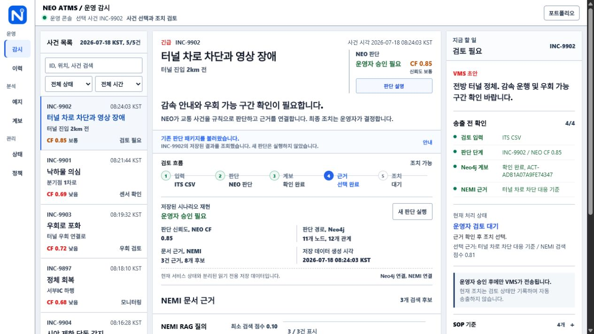
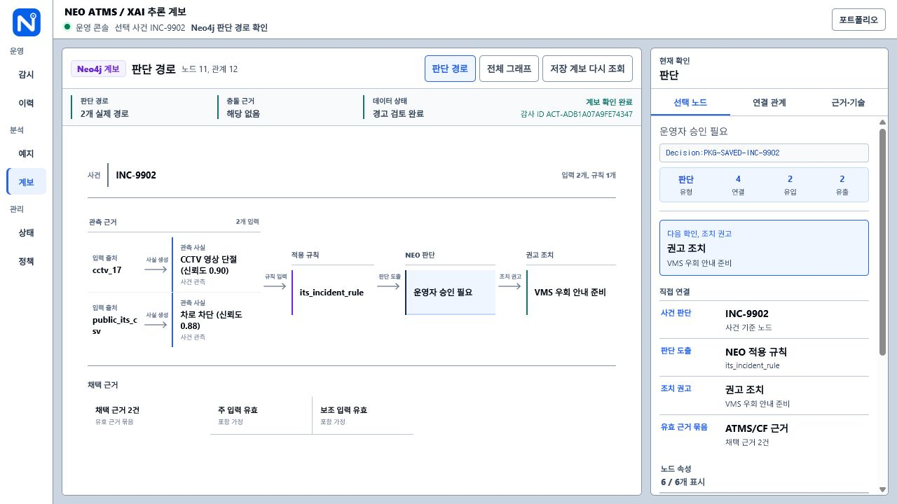
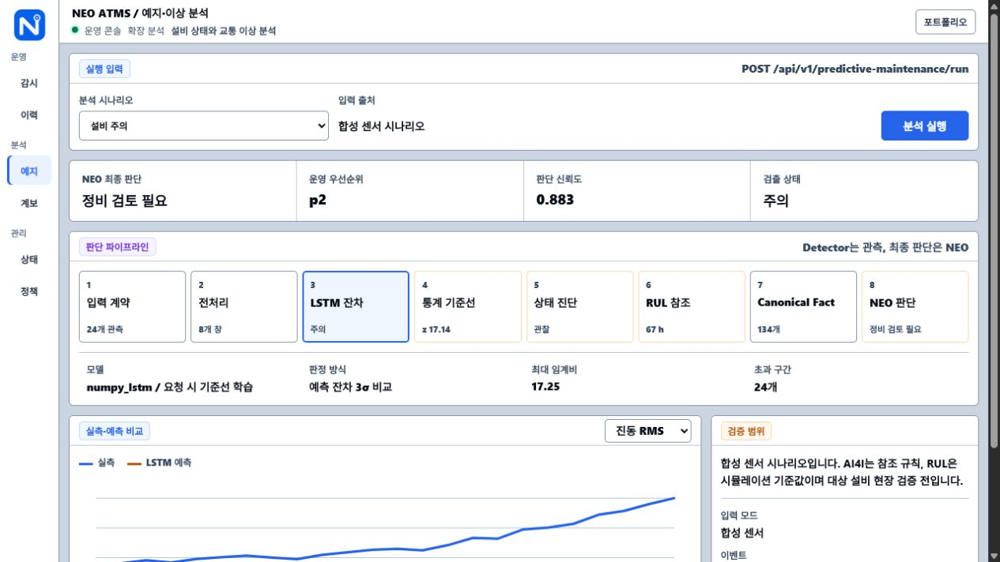
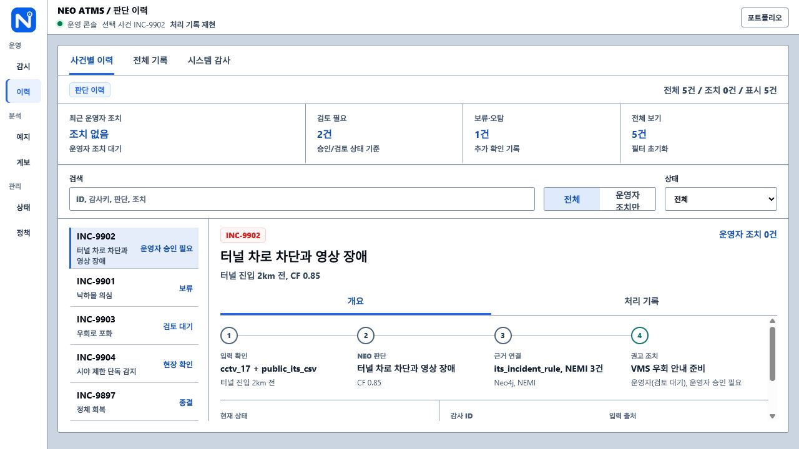
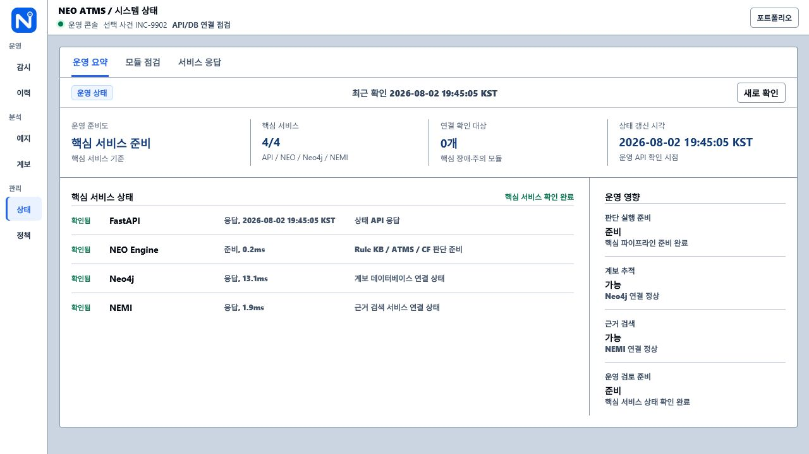
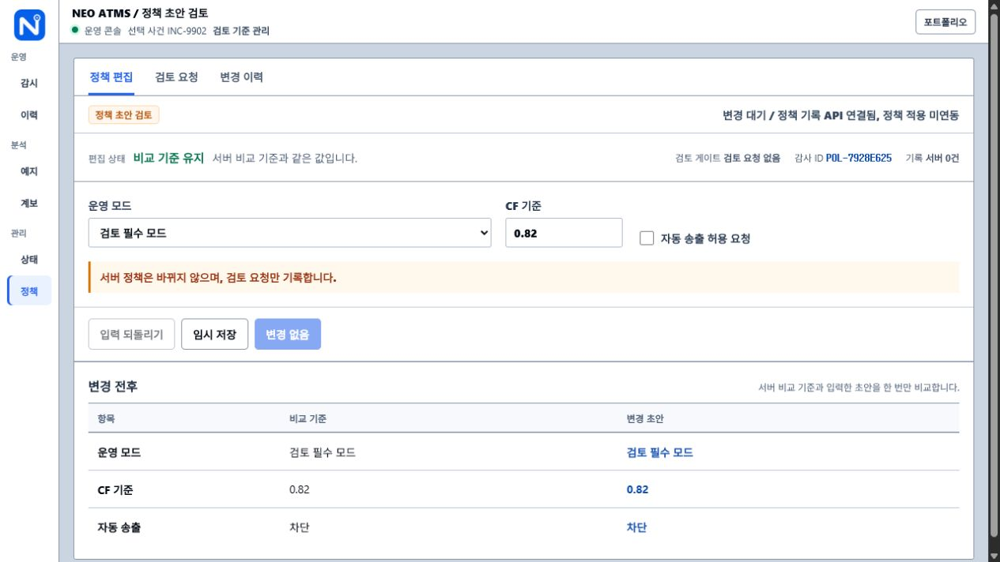
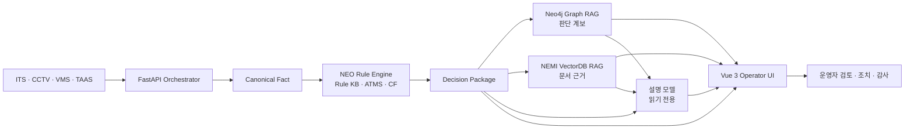

# NEO Intelligent ITS Operator

단일 수치나 알람만으로는 현장 상황을 정확히 판단하기 어렵습니다. NEO는 여러 관제 입력을 종합해 위험도를 판단하고, 판단 근거와 대응 가이드까지 함께 제공하는 지능형 관제 시스템입니다.

> `NEO`는 이 프로젝트에서 명명한 자체 규칙 추론 엔진입니다. Rule KB, ATMS(Assumption-based Truth Maintenance System), CF(Certainty Factor)를 결합해 판단합니다.

> 핵심 규칙 엔진과 Rule KB는 비공개 자산입니다. 이 저장소에는 운영 화면, 설계 계약, 작업공간 안내와 AWS 배포 기록만 공개합니다.

- **AWS 데모:** https://3-38-33-156.sslip.io/neo

## 주요 화면

<table>
  <thead>
    <tr>
      <th align="center" width="50%">실시간 관제와 운영 검토</th>
      <th align="center" width="50%">Neo4j XAI 추론 계보</th>
    </tr>
  </thead>
  <tbody>
    <tr>
      <td align="center" width="50%"></td>
      <td align="center" width="50%"></td>
    </tr>
    <tr>
      <th align="center" width="50%">예지 및 이상 분석</th>
      <th align="center" width="50%">판단·조치 이력</th>
    </tr>
    <tr>
      <td align="center" width="50%"></td>
      <td align="center" width="50%"></td>
    </tr>
    <tr>
      <th align="center" width="50%">핵심 서비스 상태</th>
      <th align="center" width="50%">정책 초안 검토</th>
    </tr>
    <tr>
      <td align="center" width="50%"></td>
      <td align="center" width="50%"></td>
    </tr>
  </tbody>
</table>

## 프로젝트 개요

교통 관제에서는 속도 저하, 정체 신호, CCTV 시야 제한처럼 서로 다른 입력이 동시에 발생합니다. 하나의 경보만 사용하면 과잉 대응하거나 중요한 충돌 신호를 놓칠 수 있습니다.

FastAPI는 입력을 Canonical Fact로 정규화해 NEO Rule KB에 전달합니다. NEO는 ATMS로 가정과 충돌 근거를 관리하고 CF로 판단 강도를 계산한 뒤, 후속 규칙을 통해 위험도와 대응 가이드를 단계적으로 생성합니다. 최종 결과만 보여주지 않고 Neo4j 관계 계보와 NEMI 문서 근거를 함께 연결해 운영자가 판단 과정을 확인하도록 구성했습니다.

| 영역 | 구현 결과 |
| --- | --- |
| 입력 정규화 | ITS CSV, 교통 API, CCTV, VMS, TAAS 입력을 Canonical Fact로 변환 |
| 규칙 추론 | NEO Rule KB + ATMS + CF 기반 다단계 파생 Fact 생성 |
| 관계 근거 | Neo4j 실제 노드·관계로 Fact → Rule → Decision 계보 조회 |
| 문서 근거 | NEMI VectorDB RAG로 SOP·정책·사고 이력 검색 |
| 판단 설명 | 현재 Decision Package와 연결 근거를 읽기 전용으로 설명 |
| 운영 검토 | 판단 재실행, 근거 선택, 조치 준비, 오탐 요청과 감사 이력 제공 |
| 예지 및 이상 분석 | LSTM 잔차, 통계 기준선, AI4I 참조 규칙, C-MAPSS 참조 RUL을 NEO 판단으로 연결 |
| 배포 | Docker Compose, AWS EC2, Nginx, HTTPS 자동 갱신 구성 |

## 핵심 운영 시나리오

1. 관제자가 실시간 사건과 입력 센서를 선택합니다.
2. FastAPI가 입력을 정규화하고 NEO 판단을 실행합니다.
3. NEO가 Rule KB, ATMS, CF를 적용해 Decision Package를 생성합니다.
4. Neo4j에서 판단 계보를 조회하고 NEMI에서 관련 문서 근거를 검색합니다.
5. 필요하면 설명 모델이 현재 판단과 연결 근거를 읽기 전용으로 설명합니다.
6. 관제자가 근거를 검토한 뒤 VMS 조치를 준비하거나 오탐 처리를 요청합니다.
7. 판단·근거·조치 상태를 감사 ID와 함께 보존하고 이력 화면에서 재현합니다.

최종 조치는 자동 송출하지 않습니다. NEO가 판단하고 운영자가 검토·승인하는 경계를 유지합니다.

### 대표 시연 사건

| 사건 | 입력 충돌과 상태 | NEO 판단 |
| --- | --- | --- |
| INC-9902 연쇄 추돌 위험 | 정체와 CCTV 시야 제한 | 운영자 승인 필요 |
| INC-9901 낙하물 의심 | 레이더 단독 감지 | 관찰 후 재확인 |
| INC-9903 우회로 포화 | 본선 정체와 우회 연결로 포화 | 교통 상황 검토 |
| INC-9904 시야 제한 단독 감지 | CCTV 저시정과 정상 교통 흐름 | 관찰 후 재확인 |
| INC-9897 정체 회복 | 속도 회복 추세 | 교통 흐름 모니터링 |

## 시스템 구성



| 구성요소 | 책임 |
| --- | --- |
| NEO Engine | 규칙 매칭, 충돌 관리, CF 계산과 파생 Fact 생성 |
| FastAPI | 입력 정규화, NEO 실행과 외부 연동 조율 |
| Neo4j | Fact·Rule·Decision 관계 저장과 XAI 계보 조회 |
| NEMI | 프로젝트 내부 명칭의 VectorDB RAG, 운영 문서 근거 검색 |
| Qdrant | NEMI 임베딩과 유사도 검색 저장소 |
| Vue 3 + TypeScript | 사건 선택, 근거 검토, 조치와 감사 이력 UI |
| 설명 모델 (선택) | 로컬 Gemma4 또는 AWS Bedrock Nova 2 Lite로 설명, NEO 판단 변경 권한 없음 |

## 구현 상세

### 규칙 추론과 충돌 관리

- 원시 입력을 스키마 검증된 Canonical Fact로 변환합니다.
- Fact가 Rule을 활성화하고, 파생 Fact가 다음 Rule에 다시 적용되는 다단계 추론을 수행합니다.
- ATMS가 가정·지지·충돌 집합을 관리하고 CF가 복수 근거의 판단 강도를 계산합니다.
- `Decision Package`에 KB 버전, Rule Set 버전과 KB SHA-256을 기록해 판단 시점의 지식 기준을 고정합니다.

### 관계·문서 근거

- Neo4j API로 실제 그래프를 저장·조회하며 선택 노드와 판단 경로를 분리해 탐색합니다.
- NEMI는 Qdrant에서 SOP, VMS 정책, TAAS 사고 이력 등 판단과 관련된 문서를 검색합니다.
- Neo4j와 NEMI는 근거를 제공할 뿐 NEO의 결론을 생성하거나 덮어쓰지 않습니다.

### 운영 안전과 감사

- 판단 실행, 계보 확인, 문서 근거 확인, 조치 준비를 명시적 단계로 분리했습니다.
- 운영자 승인 전에는 VMS 조치를 자동 송출하지 않습니다.
- 사건, 판단, 선택 근거, 조치 상태와 감사 ID를 함께 저장해 이후 재현할 수 있습니다.

### 읽기 전용 판단 설명

- 현재 Decision Package, Neo4j 판단 관계와 NEMI 문서 근거만 설명 입력으로 사용합니다.
- 로컬·GPU 환경은 Gemma4, AWS 데모는 Amazon Nova 2 Lite를 사용합니다.
- 설명 모델은 NEO가 정한 판단, 우선순위, 신뢰도와 권고 조치를 변경할 수 없습니다.

### 예지 및 이상 분석

- 설비 4종과 교통 2종 시나리오를 동일 API에서 실행하고 분석 단계를 화면에서 확인합니다.
- NumPy LSTM 잔차와 Z-score 3σ 기준선을 Canonical Fact로 변환해 NEO 판단에 연결합니다.
- AI4I는 학습 모델이 아닌 참조 규칙이며, C-MAPSS RUL은 대상 설비에 보정되지 않은 시뮬레이션 기준값임을 화면과 API에 명시합니다.

## 데모 확인

- [AWS 운영 데모](https://3-38-33-156.sslip.io/neo)
- 관제, 계보, 이력, 예지·이상 분석, 상태와 정책 화면을 하나의 운영 흐름으로 확인할 수 있습니다.
- 판단 카드의 `판단 설명`에서 Amazon Nova 2 Lite의 한국어 설명을 확인할 수 있습니다.

## Docker 이미지

| 구성요소 | Docker Hub v1.0.0 |
| --- | --- |
| Vue 관제 화면 | [`kimmj6466/neo-operator-frontend:v1.0.0`](https://hub.docker.com/r/kimmj6466/neo-operator-frontend) |
| NEO FastAPI | [`kimmj6466/neo-operator-api:v1.0.0`](https://hub.docker.com/r/kimmj6466/neo-operator-api) |
| NEMI API | [`kimmj6466/neo-nemi-api:v1.0.0`](https://hub.docker.com/r/kimmj6466/neo-nemi-api) |

AWS 실행본은 태그 변경의 영향을 받지 않도록 위 이미지의 v1.0.0 다이제스트를 고정해 사용합니다.

## 배포와 검증

- AWS EC2 Ubuntu에서 프론트엔드, FastAPI, NEMI, Neo4j, Qdrant 컨테이너 실행
- 호스트 Nginx가 HTTPS 요청을 내부 프론트엔드 `127.0.0.1:8080`으로 전달
- FastAPI, NEMI, Neo4j, Qdrant 포트는 loopback에만 바인딩
- EC2 인스턴스 역할로 Amazon Bedrock Nova 2 Lite 호출
- 설명 API에 IP당 분당 6회, 128KB 본문, HTTP 429 제한 적용
- `/neo`, `/neo/predictive`, `/neo/lineage`, `/neo/logs`, `/neo/health`, `/neo/settings` 응답 확인
- HTTP → HTTPS 전환과 Certbot 인증서 자동 갱신 모의시험 확인
- v1.0.0 공개 파이프라인 확인: NEO 판단, Neo4j 20노드·28관계, NEMI 문서 2건
- 2026-08-02 실제 Bedrock 한국어 설명 응답 확인: 입력 803토큰, 출력 161토큰, 1,305ms

## 산출물

| 문서 | 내용 |
| --- | --- |
| [AWS EC2 배포 기록](docs/deployment/AWS_EC2_DEPLOYMENT.md) | 인스턴스 생성부터 Docker Compose, HTTPS 적용까지의 화면 기록 |
| [Canonical Fact 표준 구조](docs/design/CANONICAL_FACT_SCHEMA.md) | 외부 입력을 표준 Fact로 정규화하는 필드와 검증 규칙 |
| [Decision Package 표준 구조](docs/design/DECISION_PACKAGE_SCHEMA.md) | 판단, 근거, 신뢰도와 버전을 기록하는 필드와 검증 규칙 |
| [작업공간 안내서](docs/WORKSPACE_GUIDE.md) | 개발 기준, 실행 입력과 내부 작업 순서 안내 |
| [v1.0.0 릴리즈 기록](docs/releases/NEO_V1.0.0.md) | GitHub, Docker Hub와 AWS에 고정한 1차 릴리즈 검증 결과 |

## 저장소 구조

```text
docs/readme/       실제 운영 화면
docs/design/       Canonical Fact·Decision Package 계약
docs/deployment/   AWS EC2·Docker·HTTPS 배포 기록
docs/releases/     버전별 배포와 검증 기록
```

## 판단 권한 원칙

```text
NEO decides.
FastAPI orchestrates.
Vue presents.
Neo4j visualizes relationships.
NEMI retrieves document evidence.
LLM explains.
```

Neo4j, NEMI, LLM과 Vue는 NEO의 판단을 생성하거나 변경하지 않습니다.
