# NEO Operator AWS 배포 기록

NEO Operator를 AWS EC2 환경에 배포하고, 프론트엔드와 백엔드 API, Neo4j, VectorDB, NEMI 검색 API를 Docker Compose로 실행한 과정을 정리했다.

## 배포 개요

- 배포 대상: NEO Operator
- 클라우드 환경: AWS EC2
- 리전: Asia Pacific (Seoul), `ap-northeast-2`
- 인스턴스: `neo-operator-ec2`
- OS: Ubuntu Server 24.04 LTS
- 인스턴스 유형: `t3.small`
- 고정 IP: Elastic IP 적용
- 실행 방식: Docker Compose
- 주요 구성: Vue/Nginx Frontend, FastAPI Backend, Neo4j, Qdrant, NEMI API

## 3. EC2 인스턴스 구성

EC2 인스턴스 이름은 `neo-operator-ec2`로 지정했다. 운영체제는 Ubuntu Server 24.04 LTS를 선택했고, 타입은 Docker 기반 멀티 컨테이너 실행을 고려해 `t3.small`로 구성했다.

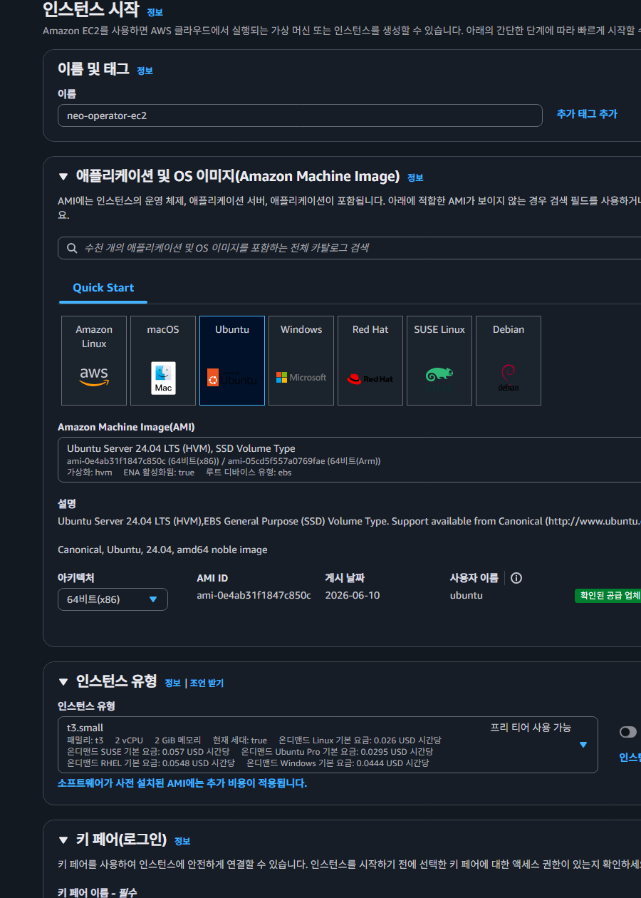

네트워크 설정에서는 SSH 접속, 웹 접속, 백엔드 확인용 포트를 분리해 보안 그룹을 구성했다. 80/443 포트는 웹 접속을 위해 열고, SSH 및 개발 확인용 포트는 제한된 접근 범위로 설정했다.

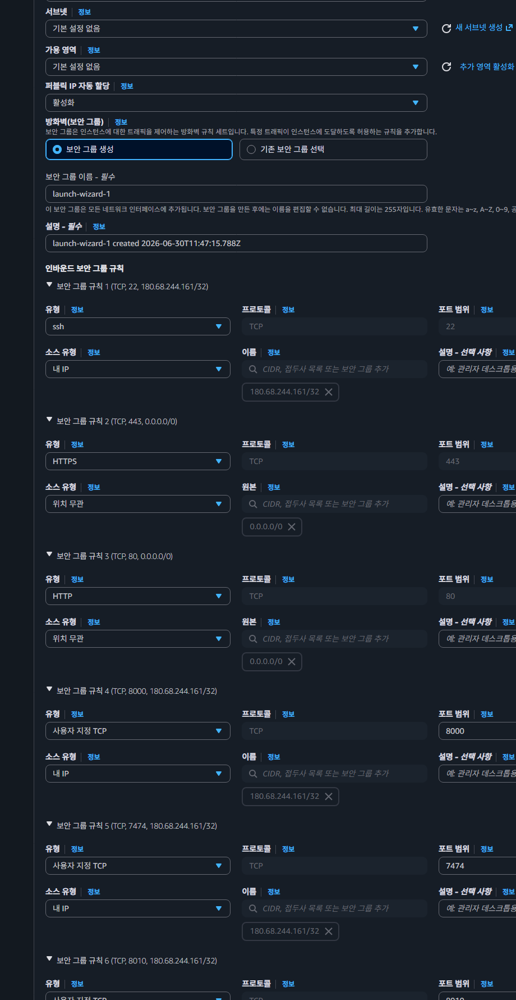

## 4. 인스턴스 생성 및 실행 확인

설정 완료 후 인스턴스를 생성했다. 생성 직후 AWS 콘솔에서 인스턴스 시작 성공 메시지를 확인했다.

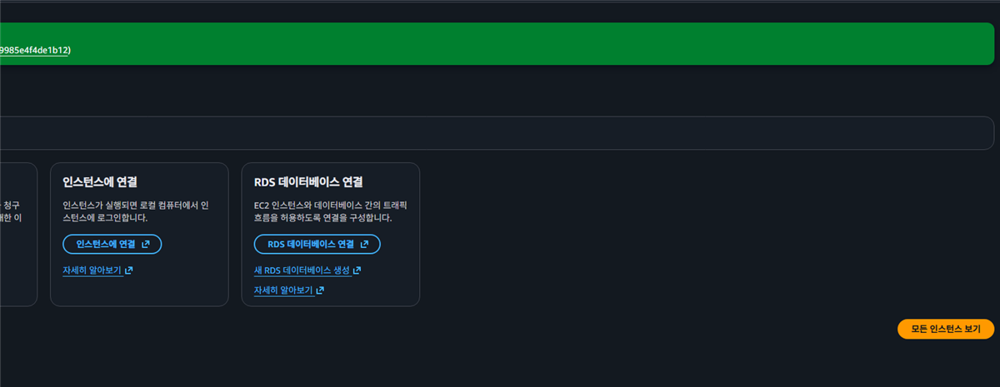

EC2 인스턴스 목록에서 `neo-operator-ec2`가 실행 중 상태로 표시되는 것을 확인했다.

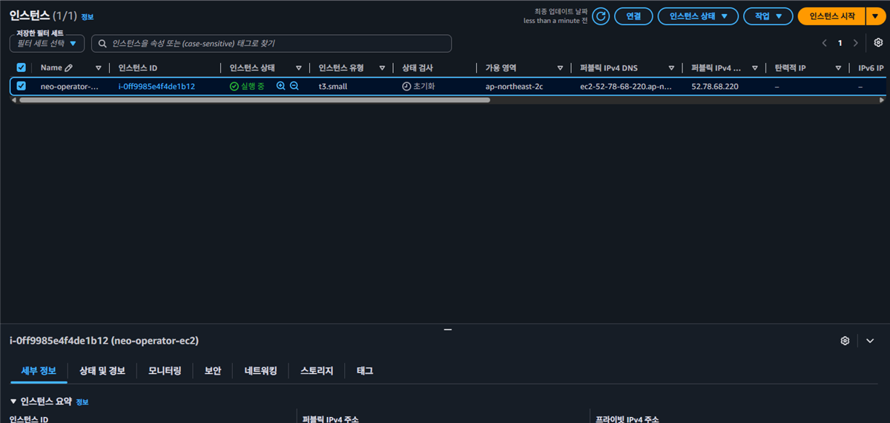

## 5. Elastic IP 적용

EC2의 기본 퍼블릭 IP는 인스턴스 재시작 시 변경될 수 있으므로, 고정 접속 주소를 확보하기 위해 Elastic IP를 할당했다.

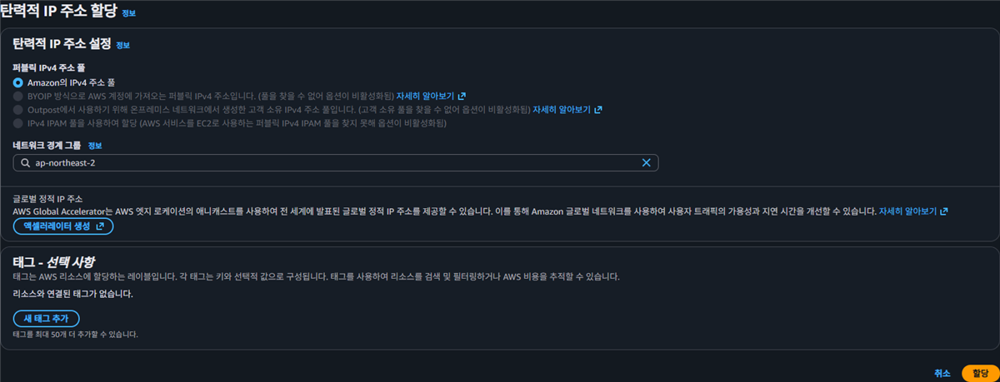

할당한 Elastic IP를 생성한 EC2 인스턴스에 연결했다.

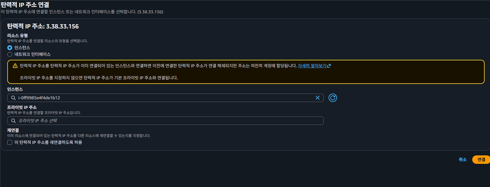

연결 완료 후 Elastic IP가 인스턴스에 정상 연결된 상태를 확인했다. 계정 식별 정보는 문서 공유를 고려해 마스킹했다.

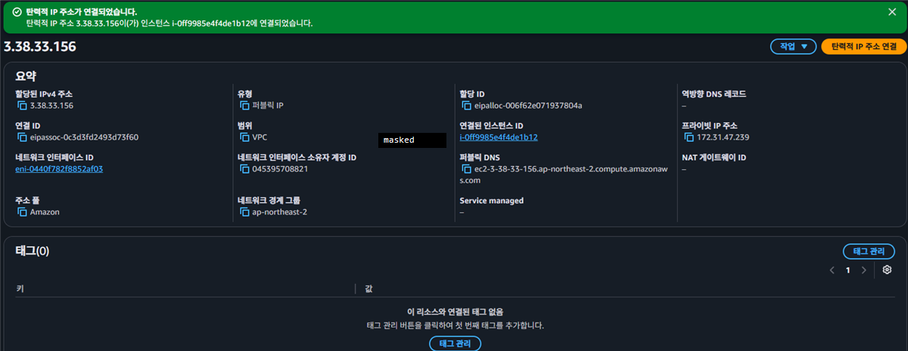

## 6. SSH 접속 확인

로컬에 저장한 `.pem` 키 파일의 권한을 조정한 뒤 SSH로 EC2에 접속했다. 접속 후 Ubuntu 24.04 LTS 환경으로 정상 진입되는 것을 확인했다.

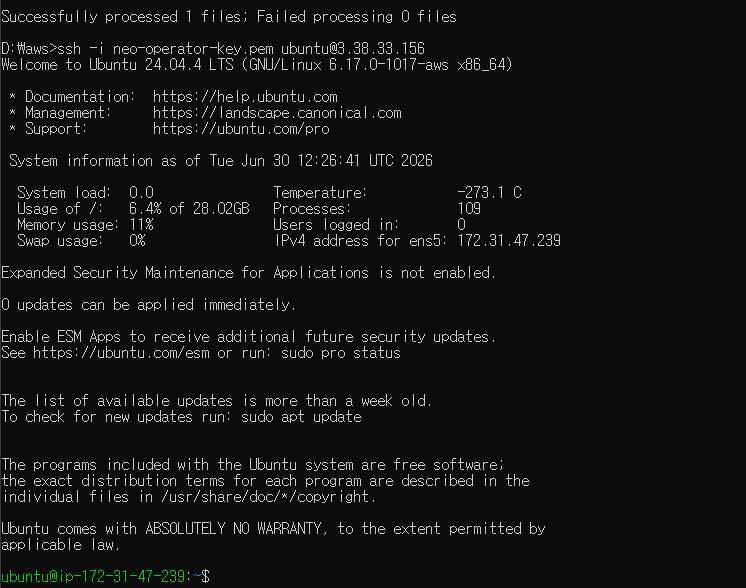

## 7. 서버 실행 환경 구성

배포 서버에서 Docker, Docker Compose, Git, Nginx 설치 상태를 확인했다. Nginx는 이후 80번 포트 충돌을 피하기 위해 Docker 프론트엔드 컨테이너가 포트를 사용하도록 정리했다.

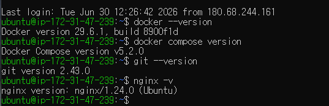

## 8. 프로젝트 파일 업로드

로컬에서 준비한 NEO 프로젝트 파일을 EC2의 `~/neo-operator` 디렉터리로 업로드했다. 업로드 대상은 Docker Compose 구성, 프론트엔드, 백엔드 API, KB, NEMI 관련 파일이다.

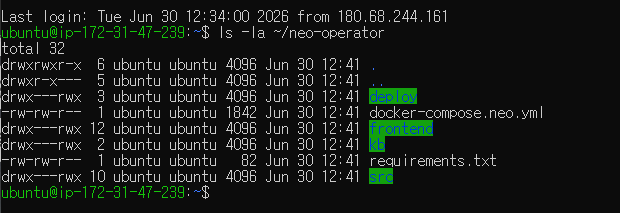

## 9. 환경 변수 설정

Docker Compose 실행에 필요한 환경 변수를 `.env` 파일로 정리했다. Neo4j 비밀번호와 포트 매핑, NEMI API URL을 설정했다. 비밀번호 값은 문서 공유를 고려해 마스킹했다.

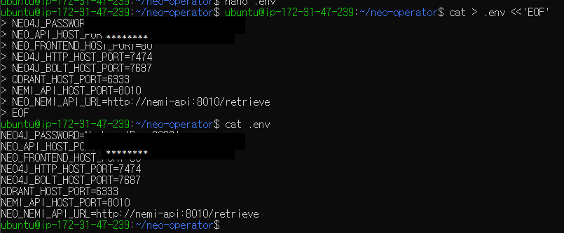

## 10. Docker Compose 빌드 및 실행

Docker Compose로 프론트엔드와 백엔드 구성 요소를 빌드했다. 프론트엔드는 Nginx 기반 정적 빌드로 실행되고, 백엔드는 FastAPI 컨테이너로 실행된다.

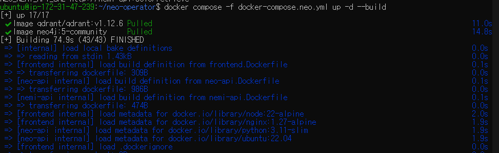

컨테이너 실행 상태를 확인했다. 최종 구성은 프론트엔드, FastAPI, Neo4j, Qdrant, NEMI API가 함께 실행되는 구조다.

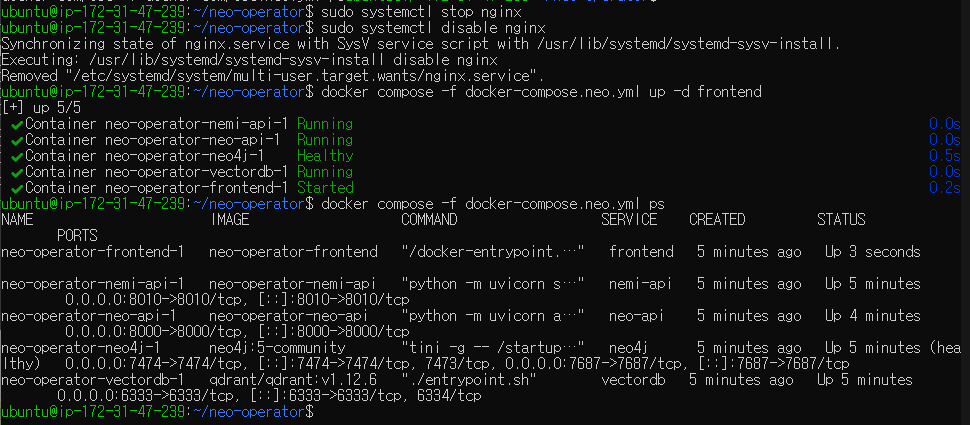

## 11. HTTP 접속 검증

EC2 내부와 외부 주소에서 HTTP 응답을 확인했다. `/neo` 경로가 정상 응답을 반환하는 것을 확인했다.

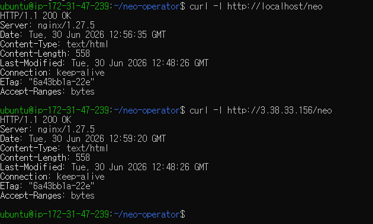

브라우저에서 Elastic IP 기반 URL로 접속해 NEO Operator 화면이 표시되는 것을 확인했다.

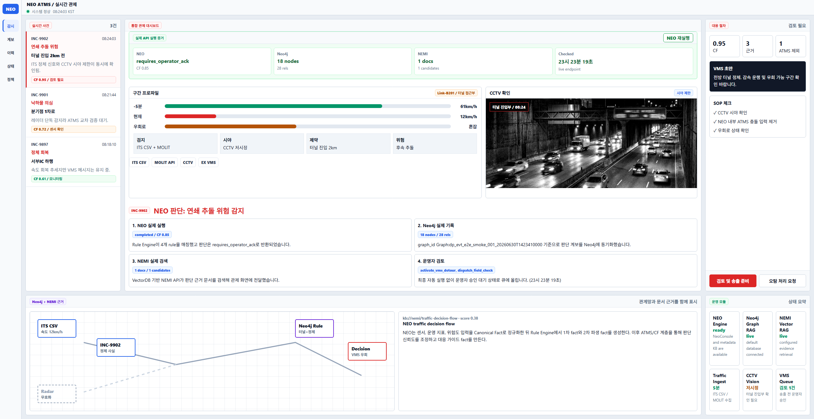

## 12. 배포 중 처리한 이슈

- 80번 포트 충돌: EC2에 설치된 호스트 Nginx가 80번 포트를 사용하고 있어 Docker 프론트엔드 컨테이너가 포트를 바인딩하지 못했다. 호스트 Nginx를 중지하고 비활성화한 뒤 프론트엔드 컨테이너를 재실행했다.
- 프론트엔드 경로 혼동: 최초 업로드 시 포트폴리오 프론트엔드가 배포되어 `/neo` 경로에 잘못된 화면이 표시됐다. NEO 전용 Vue 프론트엔드로 교체 후 재빌드했다.
- NEMI 검색 결과 0건: 일반 decision package 기반 검색에서는 문서가 반환되지 않아, NEMI corpus의 evidence type과 query key를 맞춰 검색 결과가 표시되도록 수정했다.

## 최종 확인

- `https://3-38-33-156.sslip.io/neo` 접속 확인
- `/neo`, `/neo/lineage`, `/neo/logs`, `/neo/health`, `/neo/settings` 라우트 정상 응답 확인
- FastAPI `/api/v1/runtime/status` 응답 확인
- NEO 판단 실행, Neo4j graph sync, NEMI retrieval 연결 확인

현재 배포는 AWS EC2에서 Docker Compose 기반으로 실행되며, NEO Operator의 프론트엔드와 백엔드 주요 구성 요소가 하나의 서버에서 동작하는 상태다.

## 13. 운영 포트 보안 점검

애플리케이션 갱신 후 Docker 포트 바인딩과 EC2 보안 그룹을 함께 점검했다. 프론트엔드는 호스트 Nginx를 통해 HTTP/HTTPS로 제공하고, FastAPI·NEMI API·Neo4j·Qdrant는 EC2의 loopback 주소(`127.0.0.1`)에만 바인딩했다.

- 보안 그룹 허용: HTTP `80`과 HTTPS `443`은 전체 접속 허용
- SSH `22`: 관리 PC의 현재 공인 IP `180.68.244.161/32`만 허용
- 제거한 개발 규칙: NEMI API `8010`, Neo4j Browser `7474`, FastAPI `8000`
- 외부 포트 재검증: `22/80/443` 열림, `6333/7474/7687/8000/8010` 닫힘

이를 통해 웹 화면과 제한된 SSH 접속만 허용하고, 내부 API와 데이터 저장소는 인터넷에 직접 노출되지 않도록 구성했다.

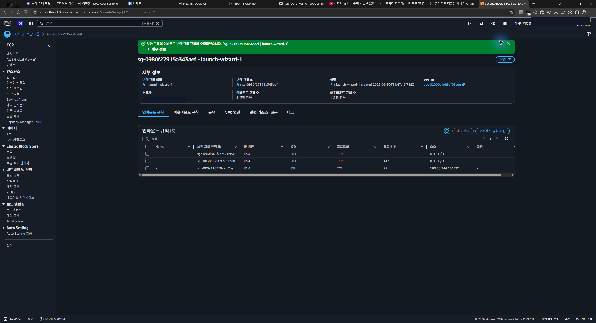

## 14. HTTPS 적용

IP 기반 임시 도메인 `3-38-33-156.sslip.io`가 Elastic IP를 가리키도록 확인한 뒤, 프론트엔드 컨테이너를 `127.0.0.1:8080`에만 바인딩했다. 호스트 Nginx는 외부의 80/443번 요청을 받아 프론트엔드 컨테이너로 전달하도록 구성했다.

Certbot과 Let's Encrypt를 이용해 TLS 인증서를 발급하고 HTTP 요청을 HTTPS로 자동 전환했다. 인증서 자동 갱신 모의시험도 정상 통과했다.

- 최종 URL: `https://3-38-33-156.sslip.io/neo`
- HTTP 요청: HTTPS로 `301` 전환
- 인증서 만료일: 2026-10-11
- 자동 갱신: Certbot 예약 작업 활성화 및 `renew --dry-run` 성공
- 전체 Vue 라우트 및 FastAPI 프록시 응답 확인

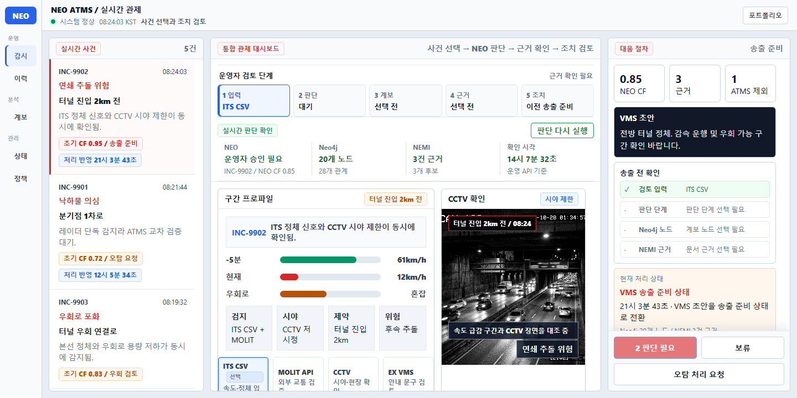

## 15. 2026-07-21 승인본 갱신

- 사용자 승인 완료된 NEO Operator 프론트엔드와 FastAPI를 새 이미지로 빌드해 교체했다.
- 배포 전 로컬 검증은 프론트엔드 production build, 백엔드 `150 passed, 9 subtests passed`를 통과했다.
- Neo4j 스키마는 중복 노드 0개, 필수 제약 9/9개로 확인했다.
- AWS에서 실시간 판단을 실행해 새 Decision Package와 `20 nodes / 28 relationships` 계보를 저장·재조회했다.
- `/neo`, `/neo/lineage`, `/neo/logs`, `/neo/health`, `/neo/settings`, 현장 증거 이미지 5종은 모두 HTTPS 200을 반환했다.
- NEO, Neo4j, NEMI는 정상이며 선택 기능인 Ollama/LLM만 미실행 상태다.
- 브라우저 콘솔 오류, FastAPI 오류 로그, 프론트엔드 5xx 응답은 모두 0건이었다.

## 16. 2026-07-22 최종 UI 승인본 갱신

- 비공개 체크포인트 커밋 `b835020`의 승인된 프론트엔드만 새 이미지로 빌드해 교체했다.
- 기존 프론트엔드 소스와 Docker 이미지는 릴리스 `20260722_000344` 롤백본으로 보존했다.
- `/neo`, `/neo/lineage`, `/neo/logs`, `/neo/health`, `/neo/settings`는 모두 HTTPS 200을 반환했다.
- 계보 판단 경로의 규칙·판단·권고 정렬과 선택 동작, 모바일 390px 무가로넘침, 브라우저 콘솔 오류 0건을 확인했다.
- 백엔드, Neo4j, Qdrant, NEMI 데이터와 컨테이너는 변경하지 않았다.

## 17. 2026-07-22 프론트엔드 빌드 의존성 보안 갱신

- 개발 전용 간접 의존성 `brace-expansion`을 호환 범위 내 보안 패치 `2.1.2`로 잠금파일에서 갱신했다.
- 로컬과 AWS Docker 빌드에서 `npm audit` 0건 및 production build 통과를 확인했다.
- 릴리스 `20260722_002315`로 프론트엔드만 교체했으며, 백엔드와 데이터 저장소는 변경하지 않았다.
